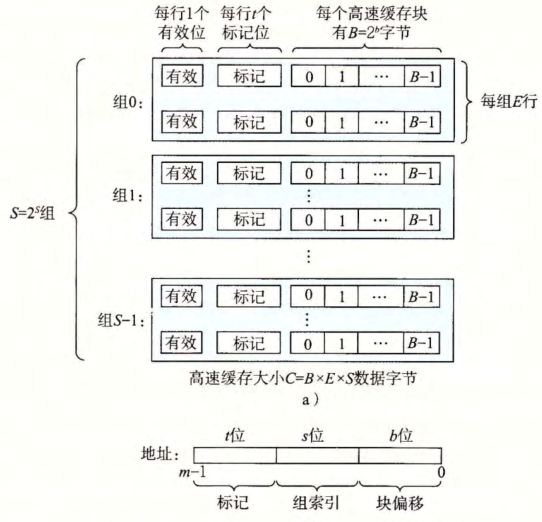
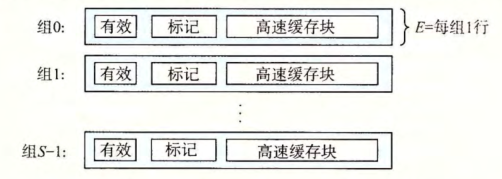
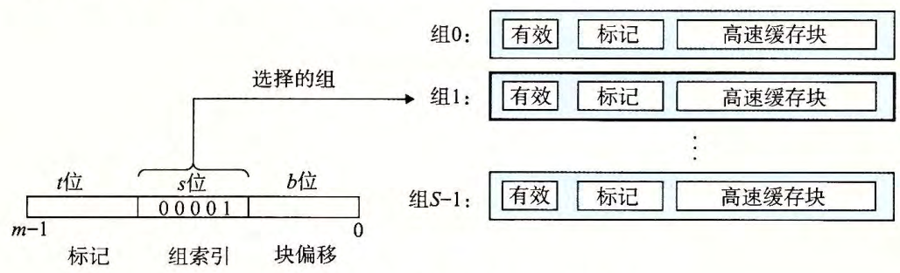
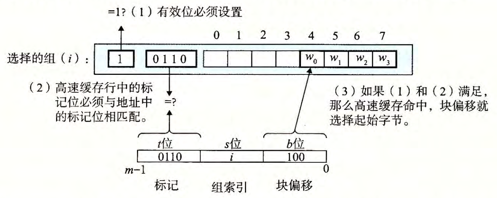
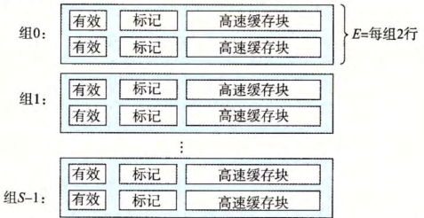
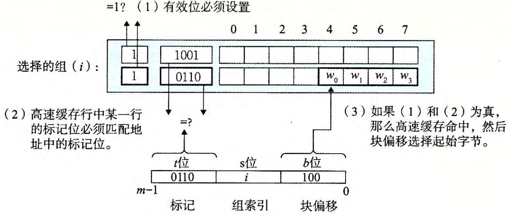
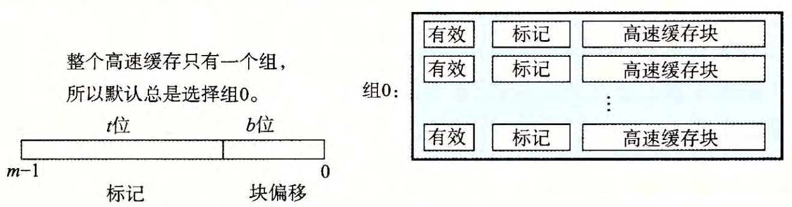
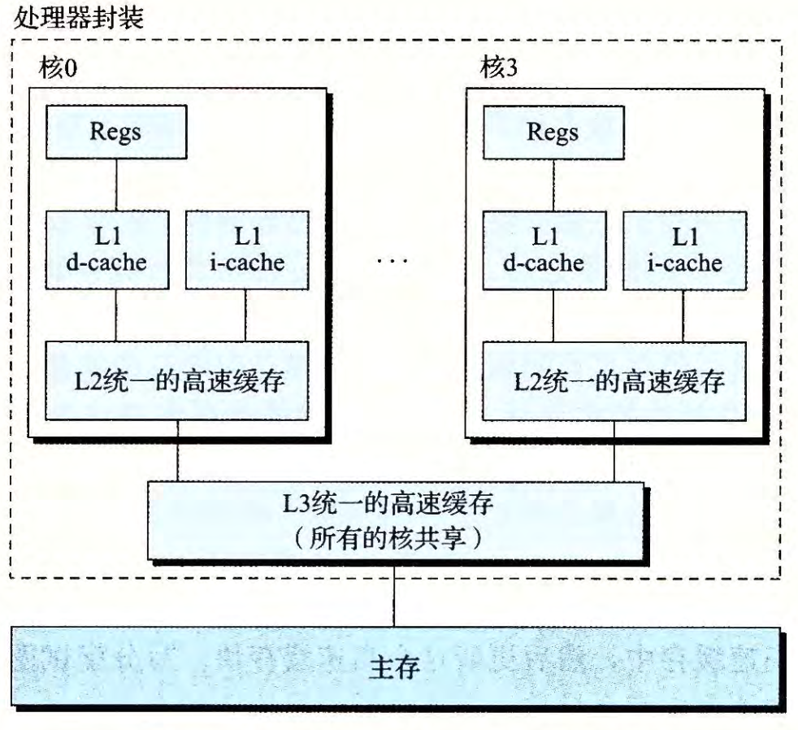

# Basic Concepts of Memory Hierarchy

## 处理器层次结构中的缓存

缓存是指地址离开处理器后遇到的最高级或第一级的存储器层次结构

**存储器层次结构的中心思想** 是：对于每个 k，位于 k 层的更快、更小的存储设备作为位于 k+1 层的更慢、更大的存储设备的缓存。
即，存储结构中的每一层缓存都来自较低一层的数据对象。

* 第 k+1 层的存储器被划分为连续的数据对象块，称为 **块** ，每个块都有唯一的地址或名字。
* 在任何时候，第 k 层的缓存都包含第 k+1 层块的一个子集的副本。
* 数据总是以块大小为传送单元在 k 和 k+1 层之间来回复制

**缓存命中 (Cache hit)** ：处理器在缓存中找到了所请求的数据项

**缓存缺失 (Cache miss)** ：处理器没有在缓存中找到所请求的数据项

* 缓存缺失需要的时间取决于存储器的延迟和带宽
    * 延迟决定提取块中第一个字的时间
    * 带宽决定提取这个块中其他数据的时间
* 覆盖一个现成的块称为 **替换/驱逐** 这个块
* 决定替换哪一个块取决于缓存的 **替换策略 (Replacement policy)**
    * 随机替换策略
    * 最近最少被使用 (LRU) 替换策略

**缓存缺失的种类** 包括：

* 强制性不命中 (Compulsory miss) / 冷不命中 (Cold miss)
    * 一个空的缓存称为冷缓存 (Cold miss)，访问该缓存会造成缓存不命中
* 冲突不命中 (Conflict miss)
    * 硬件缓存采用的一种放置策略 (Placement policy)：将 k+1 层的某一个块限制放置在 k 层的一个小的子集中
    * 可能导致连续访问的两个块被限制在 k 层的同一个区域中，无法连续命中
* 容量不命中 (Capacity miss)
    * 程序每个阶段访问缓存块中某个相对稳定不变的集合（工作集）
    * 当工作集的大小超过缓存的大小时，缓存经历容量不命中

## 缓存性能

* 存储器停顿周期：由于等待存储器访问造成的停顿周期数
* $ CPU执行时间=(CPU时钟周期数+存储器停顿周期数)\times 时钟周期时间$
* 缺失代价：每次缺失的成本
    * $ 存储器停顿周期=缺失数\times缺失代价=IC\times\frac{存储器访问次数}{指令}\times缺失率\times 缺失代价 $
    * 缺失率 (Miss Rate)：导致缺失的访问除以总访问数，是 **缓存设计中最重要的度量之一**
* 每条指令的缺失数
    * $\frac{缺失数}{指令}=缺失率\times \frac{存储器访问次数}{指令}$

## 高速缓存存储器

### 通用的高速缓存存储器组织结构

* 每个存储器地址有 $m$ 位，形成 $M=2^m$ 个不同的地址
* 一个高速缓存被组织成一个有 $S=2^s$ 个 **高速缓存组** 的数组
* 每个组包含 $E$ 个 **高速缓存行**
* 每一行由：
    * 一个 $B=2^b$ 字节的 **数据块**
    * 一个 **有效位(Valid bit)** 指明该行是否有有意义的信息
    * $t=m-b-s$ 个 **标记位** ：唯一地标识存储在这个高速缓存行中的块
* 高速缓存的结构可以由元组 $(S, E, B, m)$ 来描述
* 高速缓存的大小（以字节为单位）： $C=S\times E\times B$
* 参数 S 和 B 将 m 个地址位分为三个字段
    * s 个组索引位：被解释为一个无符号数，告诉我们这个字必须存储在哪个组中
    * t 个标记位：告诉我们这个组中的哪一行包含这个字
    * b 个块偏移位：给出在 B 个字节的数据块中的字偏移

<figure>
  
  <figcaption>Cache Structure</figcaption>
</figure>

### 直接映射高速缓存

每个组只有一行的高速缓存被称为 **直接映射高速缓存 (Direct-mapped Cache)**，即 $E=1$

<figure>
  
  <figcaption>Direct-mapped Caches</figcaption>
</figure>

高速缓存确定一个请求 w 是否命中，然后抽取出被请求的字的过程分为三部分。

1. **组选择** ：从地址中提取组索引位。这些位被解释成一个对应于组号的无符号整数。

<figure>
  
  <figcaption>Set Select of Direct-mapped Caches</figcaption>
</figure>

2. **行匹配** ：高速缓存的 **有效位** 设置了，而且 高速缓存的 **标记位** 与 w 的地址中的标记相匹配时，这一行包含了 w 的一个副本。

<figure>
  
  <figcaption>Row Select of Direct-mapped Caches</figcaption>
</figure>

3. **字选择** ：一旦命中，我们知道w就在这个块的某个地方。最后一步确定所需要的字再块中是从哪里开始的。 **块偏移位** 提供了所需要的字从哪里开始。

如果缓存不命中，那么它选哟从存储器层次结构中的下一层取出被请求的块，然后把新的块存储在族所因为指示的组中的一个高速缓存行中。
一般而言，如果组中都是有效的高速缓存行，那么必须驱逐出一个现存的行。对于直接映射高速缓存，驱逐策略是简单的： **驱逐组中的唯一一行。**

直接映射高速缓存中常会发生冲突不命中

* **抖动 (thrash)**：高速缓存反复地加载和去除相同的高速缓存块的组
* 解决方法：在每个数组的结尾放B字节的填充

### 组相连映射高速缓存

每个组保存多于一个的高速缓冲行称为 **组相联高速缓存 (Set Associative Cache)**，即 $1<E<\frac{C}{B}$

<figure>
  
  <figcaption>Set Associative Caches</figcaption>
</figure>

1. **组选择** ：从地址中提取组索引位。这一操作与直接映射高速缓存中的操作相同。
2. **行匹配** ：必须检查同一个组中多个行的标记位于有效位，以确定所请求的字是否在集合中。高速缓存搜索组中的每一行，寻找一个有效的行，其标记与地址中的标记相匹配。
3. **字选择** ：一旦命中，我们知道 w 就在这个块的某个地方。最后一步确定所需要的字再块中是从哪里开始的。 **块偏移位** 提供了所需要的字从哪里开始。

<figure>
  
  <figcaption>Row Select of Set Associative Caches</figcaption>
</figure>

如果 CPU 请求的字不在组中的任何一行，那么就是缓存不命中。高速缓存必须从内存中取出包含这个字的块。
如果该组中没有空行，那么我们必须从中选择一个非空的行进行替换。 **替换策略** 包括：

* *最不常使用 (Least-Frequently-Used, LFU)* 策略：替换在过去某个时间窗口内引用次数最少的那一行
* *最近最少使用 (Least-Recently-Used, LRU)* 策略：替换最后一次访问时间最久远的那一行

### 全相连映射高速缓存

全相连高速缓存中的组选择很简单，因为只有一个组。地址中 **没有组索引位** ，地址只被划分为一个标记和一个块偏移。

<figure>
  
  <figcaption>Fully Associative Caches</figcaption>
</figure>

全相联高速缓存中的行匹配和字选择与组相联高速缓存中是一样的，他们之间的区别主要是规模大小的问题。

因为高速缓存电路必须并行地搜索许多相匹配的标记，构造一个又大又快的相连高速缓存很困难，而且很昂贵。
因此全相联高速缓存只适合做小的高速缓存，例如虚拟内存系统中的翻译备用缓冲器 (TLB)，它缓存页表项。

### 如何写入缓存

假设要写一个已经缓存的字 W:

写命中 (Write hit)，需要更新 W 在层次结构中紧接着低一层中的副本

* **直写 (Write-through)**：立即将 W 的高速缓存块写回低一层中
    * 更容易实现，简化数据一致性
    * 每次写都会引起总线流量
    * 如果处理器在直写期间必须等待写操作完成，则称处理器处于 **写入停顿** 状态
    * 减小写入停顿的方案： 增加一个 **写缓冲区** ：数据被写入缓冲区后，处理器可以继续执行
        * 写缓冲区本质上就是一个 FIFO 队列
        * 当存储频率接近于 DRAM 的写入速度时（假设高速缓存的低层存储是主存），写缓冲区可能会发生饱和
* **写回 (Write back)**：当替换算法要驱逐这个块时，才把它写回低一层中
    * 由于局部性，能够显著减小总线流量，对多处理器更具有吸引力
    * 增加复杂性，高速缓存需要为每个高速缓存行维护一个额外的 **修改位 (Dirty bit)** ，表明这个告诉缓存块是否被修改过。

若发生写不命中 (Write miss)

* **写分配 (Write-allocate)**：加载相应的第一层中的块到高速缓存中，然后更新这个高速缓存块
    * 每次不命中都会导致一个块从低一层传到高速缓存
* **非写分配 (Not-write-allocate)**：避开高速缓存，直接将这个字写到低一层

**直写高速缓存通常是非写分配**， 而 **写回高速缓存通常是写分配**

### 一个真实的高速缓存层次结构的剖析

* **i-cache**：只保存指令的高速缓存
* **d-cache**：只保存数据的高速缓存
* **unified cache**：既保存指令又保存数据的高速缓存
* 现代处理器有独立的 i-cache & d-cache
	* 处理器能够同时读指令与数据
	* i-cache 通常为只读的，可以用不同的访问模式优化这两个缓存，可以有不同的块大小、相联度、容量

下图是 Intel Core i7 处理器的高速缓存层次结构。每个 CPU 有四个核，每个核有一个独立的 L1 d-cache 和 L1 i-cache，以及 L2 统一的高速缓存，所有核共享一个 L3 高速缓存。

<figure>
  
  <figcaption>Cache Subsystem of Intel Core i7</figcaption>
</figure>

### 高速缓存参数的性能影响

* 不命中率 (Miss Rate)：在一个程序执行期间，内存引用不命中的比率
* 命中率：1-不命中率
* 命中时间 (Hit Time)：从高速缓存传送一个字到 CPU 所需的时间，包括组选择、行确认、字选择的时间。对于 L1 高速缓存，命中时间通常是几个时钟周期
* 不命中处罚 (Miss Penalty)：由于不命中所需的额外时间。L1 不命中的时间通常是数十个周期，L2 不命中的时间通常是 50 个周期左右，L3 不命中的时间通常是数百个周期。

**高速缓存大小的影响**

一方面，较大的高速缓存可能会提高命中率，另一方面，较大的高速缓存可能会增加命中时间。

**相联度的影响**

较高的相连度降低了高速缓存由于 **冲突不命中** 而出现 **抖动** 的可能性；但是，较高的相连度会造成更高的成本，而且难以使之速度更快。
每一行需要更多的标记位，额外的LRU状态位和额外的控制逻辑。较高的相连度会增加命中时间，因为复杂性增加了，另外还会增加不命中处罚，因为选择牺牲行的复杂性也增加了。

**块大小的影响**

一方面，较大的块能利用程序中可能存在的空间局部性，帮助提高命中率。
另一方面，对于给定的高速缓存大小，块越大就意味着高速缓存的行数越少，这会损害时间局部性比空间局部性更好的程序的命中率。
较大的块对不命中处罚也有负面影响，因为块越大，不命中时需要从低一层传输的数据越多，传送时间就越长。

为了降低不命中处罚，可以考虑采用如下的措施：

* Early Restart: datapath resumes execution as soon as the requested word of the block is returned.
* Requested word first: requested word is transferred from the memory to the cache (and datapath) first.
* Non-blocking cache: cache can accept new requests while miss is outstanding. (Out-of-order execution)

**写策略的影响**

直写高速缓存比较容易实现，而且能使用独立于高速缓存的写缓冲区，用来更新内存。另外，读不命中的开销没有这么大，因为他们不会触发内存写。
另一方面，写回高速缓存引起的传送比较少，它运训更多的到内存的带宽用于执行DMA的I/O设备。此外，越往层次结构底层走，传送时间增加，减少传送的数量就变得更加重要。

一般而言，高速缓存越往下层，写回策略越有利。

## 损失代价与乱序执行处理器

* 定义缺失代价为 **非重叠延迟**
* $\frac{存储器停顿周期}{指令}=\frac{缺失数}{指令}\times (总缺失延迟-重叠缺失延迟)$
* **存储器延迟长度**——在乱序执行处理器中如何确定存储器操作的起止时刻
* **延迟重叠的长度**——如何确定与处理器重叠的起始时刻

## 存储器层次结构设计

### 优化缓存的 10 种高级方法

1. 采用小而简单的第一级缓存，缩短命中时间、降低功耗
    * 缓存命中的关键计时路径由三个部分组成：
        * 使用地址中的索引确定标签存储器的地址
        * 将读取的标签值与地址进行比较
        * 若缓存为组相联，则设置MUX选择正确的数据项
    * 使用较低级别的相联度可以缩短命中时间、降低功耗
    * 降低功耗：增大块大小、多体缓存（将缓存分为多个存储体，每次只激活一部分）

2. 采用路预测以缩短命中时间
    * 在 **路预测技术 (Way Prediction)** 中，缓存中另外保存了一些位，用于预测 **下一次** 缓存访问中的路（即组中的块）
        * 提前设定多路复用器，以选择所需要的块
        * 在这个时钟周期中，在读取缓存数据的同时，只需要并行执行一次标签比较
        * 如果缺失，会在下一个时钟周期中再查看其它块，以找出匹配项
    * 在一个缓存的每个块添加 **块预测位** ，根据这些为选定在下一次缓存访问中尝试哪些块
        * 如果预测正确，缓存访问延迟就等于这一快速命中时间
        * 如果预测错误，则尝试其他块，改变路预测其
    * 一种扩展形式的路预测——使用路预测位来判断实际访问的缓存块，用来降低功耗，称为 **路选择 (Way Selection)**

3. 通过缓存访问流水化和采用多体缓存来提升带宽
    * L1 缓存实现流水化后，时钟频率上升，但是会增加延迟
    * 指令缓存访问的流水化实现上增加了流水线的段数，增加了分支预测错误的代价
    * 数据缓存的流水化增加了从发出载入指令到使用数据之间的时钟周期数
    * 指令缓存的流水化相对容易，因为处理器可以依赖于高性能的分支预测来减轻延迟造成的影响
    * 为了在每个时钟周期内处理多个数据缓存访问， **将缓存划分为独立的存储体** ，每个存储体为一次独立的访问提供支持
        * 目标：访问请求均匀分布在缓存组之间，以达到最佳的分体效果
        * 实现方法：优化地址映射到存储体的方式。一种简单有效的映射方式：将缓存块地址按顺序分散在这些存储体之中—— **顺序交错 (Sequential Interleaving)**
    * 分体缓存的其他好处：实现非阻塞式缓存、降低功耗

4. 采用 **非阻塞缓存** ，以增加缓存带宽
    * 对于允许乱序执行的流水化计算机，其处理器不必因为一次数据缓存缺失而停顿
    * 非阻塞缓存 (Non-blocking Cache)，或称无锁缓存 (Lockup-free Cache)，允许数据缓存再一次确实期间继续提供缓存命中
    * 此外，如果能够重叠多个缺失，缓存能进一步降低实际的缺失代价，即多次缺失时依然命中 (Hit under multiple miss) 或者缺失时缺失 (Miss under miss)
    * **非阻塞缓存的实现**
        * 仲裁命中和缺失之间的冲突：非阻塞缓存中，命中可能会与低一级存储器中返回的缺失发生冲突
            * 首先为命中赋予比缺失更高的优先级
            * 其次在出现互相冲突的缺失时对其进行排序
        * 跟踪尚未解决的缺失，以便知道何时可以处理载入或存储操作
        * 简单情况：缺失总是按照顺序返回，可以维护一个简单的队列，先返回等待时间最长的缺失
            * 可能出现的问题：L1 中的缺失可能在 L2 中发生缺失，若 L2 是非阻塞的，那么缺失的返回顺序未必与发生顺序一致；缓存访问时间不一致的多和系统以及其他多处理器系统，也可能会引入这一复杂性
        * 返回缺失时，处理器必须知道：
            * 哪个载入或存储操作导致此次的缺失
            * 将数据放到缓存中的什么位置（针对此块的标签设置）
        * 这些信息保存在一组寄存器中，称为 **缺失状态处理寄存器 (Miss Status Handling Register, MSHR)**
        * 发生缺失时，分配一个 MSHR 处理此次缺失，分配一个 MSHR 的索引号，以此标记存储器的请求
        * 存储器系统在返回数据时使用该标签，从而使缓存系统能够将数据和标签信息传送给适当的缓存块
        * 并向生成该缺失的载入/存储操作发出“通知”，使其恢复执行

5. 利用关键字优先和提前重新执行以降低损失代价
    * 处理器通常一次仅需要缓存块中的一个字，无需等待整个块载入完成，即可以发送请求的字并重新执行处理器
    * **关键字优先**
        * 首先从存储器中请求缺失的字，在其达到缓存后立刻发送给处理器
        * 处理器能够在载入块中其他的字时继续执行
    * **提前重新执行**
        * 以正常顺序提取字，但只要块中的被请求字达到缓存，就立即将其发送给处理器，让处理器继续执行

6. 合并写缓冲区以降低缺失代价
    * 写缓冲区包含经过修改的块
    * 检查其他经过修改的块的地址是否匹配写缓冲区中某个条目的有效地址
    * 如果匹配，则将新数据与这个条目合并在一起，称为 **写合并 (Write Merging)**

7. 采用编译器优化以降低缺失率（软件优化）
    * **循环交换**
        * 程序中存在嵌套循环，以非连续顺序访问存储器中的数据
        * 交换循环的嵌套顺序，使得顺序访问存储器
    * **分块**
        * 通过改善时间局部性来减少缓存确实

8. 对指令和数据进行硬件预取，以降低缺失代价或缺失率
    * 在处理器真正需要某个数据之前，预先获取他们
    * 指令和数据都可以预先提取，即可以直接放在缓存中，也可以放在一个访问速度快于主存储器的外部缓冲区
    * 预取操作需要利用空闲的存储带宽，但如果它干扰了其他关键路径缺失内容的访问，反而会导致性能下降
    * 如果预取的数据未被用到或者替换了有用数据，预取操作会对功耗产生负面影响

9. 用编译器控制预取，以降低缺失代价或缺失率
    * 将执行过程与数据预取过程重叠
    * **寄存器预取** 将数据值载入一个寄存器当中
    * **缓存预取** 仅将数据载入缓存，而不载入寄存器
    * 只有在处理器预取数据时能够继续工作，预取才有意义
    * 发出预取指令会带来指令开销

10. 使用 HBM 扩展存储器层次结构

* 使用与计算芯片封装在一起的 DRAM 构建大容量的 L4 缓存
* 基于 DRAM 的缓存带来的问题：缓存标签的存放 -> 增大块的大小
    * 如果许多块中的内容都用不到，缓存的使用效率会下降 -> **碎片化问题**
	    * 解决方法：增加 **子块** ：允许缓存行中只有部分数据是有效的，当发生缺失时，只获取其中有效的子块
    * 由于数据块比较大，DRAM 缓存中保存的不同数据块的数目少得多，导致更多的缺失
