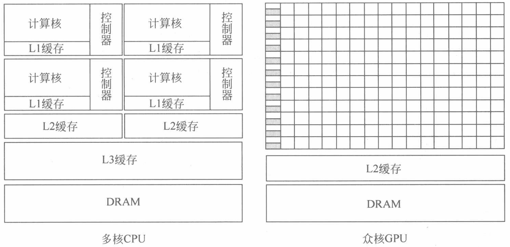
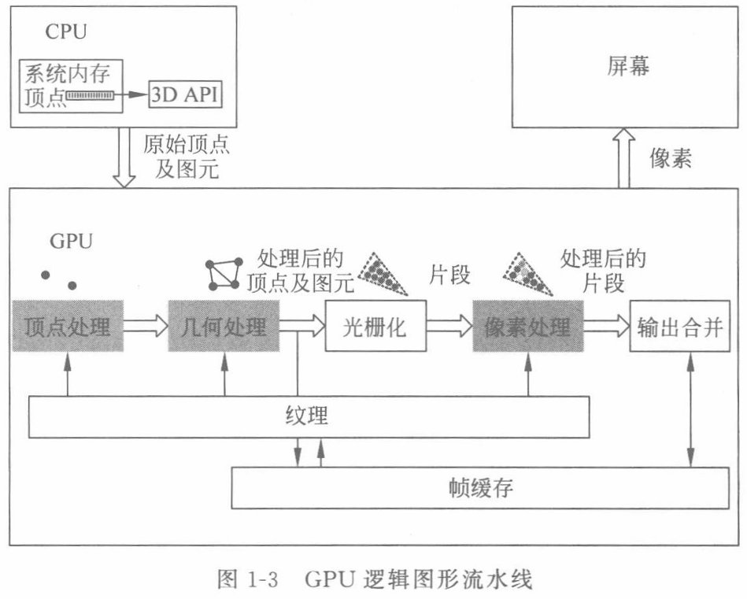
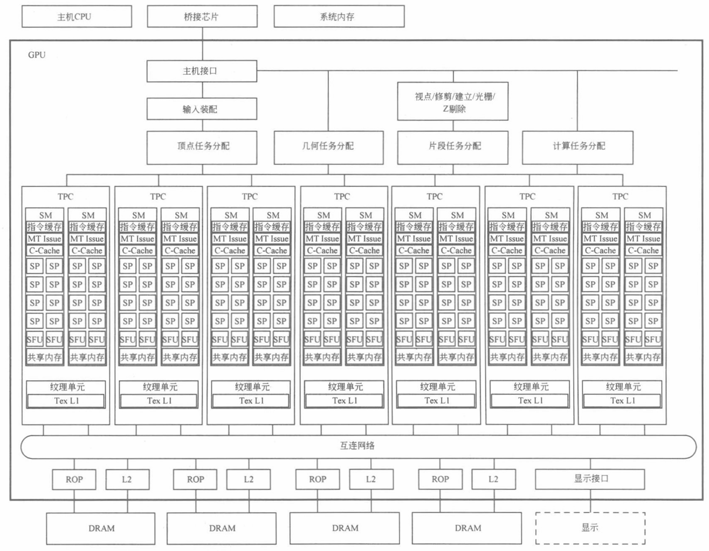

# Introduction to GPGPUs

!!! info "本节内容"
    本节内容主要来自《通用图像处理器设计：GPGPU 编程模型与架构原理》第一章，以及 [tiny_gpu](https://github.com/adam-maj/tiny-gpu) 的说明文档。

## GPGPU 与并行计算机

GPGPU (General Purpose Graphics Processing Unit，通用图形处理器) 早期由于游戏产业的推动，成为专门为提升图形渲染效率而设计的处理器芯片。随着人工智能的飞速发展，GPGPU 由于其强大的运算能力和高度灵活的可编程性，成为了**深度学习训练和推理**最重要的计算平台。
这得益于 GPGPU 的体系结构很好地适应了当今**并行计算**的需求。

并行计算机是“一些处理单元的集合，它们通过通信和协作快速解决一个大的问题”。可以看出，并行计算机有几个关键要素：

* 处理单元：具有指令处理和计算能力的逻辑电路，定义了并行计算的功能特性；
* 通信：处理单元彼此之间的数据交互；
* 协作：并杏仁糊再执行过程中相对其他任务的同步关系，约束了并行计算机进行多任务处理的顺序，保障其正确性。

从这个定义看，GPGPU 体系结构符合并行计算机的定义，是当今并行计算机最成功的设计范例之一。

### 并行体系结构

Flynn 在 1972 年就对不同类型的并行性进行了研究，并且根据指令流和数据流的关系定义了并行计算机的类型。

* 指令流：单个程序技术去产生的指令序列，
* 数据流：指令所需的数据及其访问地址的序列，包括输入数据、中间数据和输出数据。

Flynn 将并行归纳为以下 4 类：

* 单指令流单数据流 (Single Instruction Stream & Single Data Stream, SISD)：SISD 并不是并行体系结构，传统的单核 CPU 就是 SISD 的代表，它在程序计数器的控制下完成指令的顺序执行，处理一个数据，但是依然可以利用*指令级并行*在指令相互独立时实现多条指令的并行。
* 单指令流多数据流 (Single Instruction Stream & Multiple Data Stream, SIMD)：SIMD是一种典型的并行体系架构，采用一条指令对多个数据进行操作。向量处理器就是 SIMD 的典型代表。很多 CPU 也增加了 SIMD 模式的指令扩展。SIMD 通常需要有高速 I/O 以及大容量存储来实现高效并行。
* 多指令流单数据流 (Multiple Instruction Stream & Single Data Stream, MISD)：MISD 是指采用多条指令来处理单条数据流。脉动阵列可以认为是 MISD 的一种实例。
* 多指令流多数据流 (Multiple Instruction Stream & Multiple Data Stream, MIMD)：MIMD 是最为通用的并行体系结构模型。它对指令流和数据流之间的关系没有限制，通常包括多个控制单元和多个处理单元。

根据实现层次不同，并行体系结构可以有多种实现方式。最基本的是单核内指令级并行，流水线技术是实现指令级并行的关键。在这个基础上是多线程和多核并行，再往上一个层次则是多计算机并行，甚至是仓储级计算机。

### GPU 与 CPU 体系结构对比

CPU 注重**通用性**来处理各种不同的数据类型，同时支持复杂的控制指令，比如条件转移、分支、循环、逻辑判断以及子程序调用等。因此 CPU 微架构的复杂度更高，是面向指令执行的高效率而设计的。
GPU 最初是针对图形处理领域而设计的，图形运算的特点是大量同类型数据的密集运算，因此 GPU 微架构是面向这种特点的计算而设计的。

不同的设计理念导致 CPU 和 GPU 在架构上相差甚远。CPU 内核数量较少，而 GPU 则由数以千计的更小、更高效的核心组成，如下图所示。
应用场景和架构上的差异还导致多核 CPU 和众核 GPU 在浮点计算性能上的差别。GPU 的浮点计算性能远高于 CPU。

<figure>
  
  <figcaption>Architecture Comparison between Multi-core CPU and Many-core GPU</figcaption>
</figure>

## GPGPU 发展概述

### GPU

GPU 计算的核心是图形图像处理。在计算机显示过程中，将三维立体模型转化为屏幕上的二维图像需要经过一系列的处理步骤，在实际设计中会形成图形处理的流水线。图形流水线需要不同的应用程序接口 (Application Programming Interface, API) 来定义他们的功能。

<figure>
  
  <figcaption>GPU Logical Graphics Pipeline</figcaption>
</figure>

这样的一个过程以较高的帧频率重复，从而使得用户可以看到一系列连续的图像变化。随着图形处理需求的日益复杂和硬件加速性能的不断完善，有越来越多的功能被添加到图形流水线中，形成了更为丰富的图形流水线操作步骤和流程。

### 从 GPU 到 GPGPU

随着 GPU 的可编程性不断提升，GPU 可以接管一部分适合自己运算的应用，利用 GPU 完成通用计算的研究也逐渐活跃起来，GPU 开始应用于图形渲染以外更多的通用领域，逐渐演化成为 GPGPU。
GPGPU 这一计算形态的演化与 GPU 架构本身的发展变革密切相关。GPU 的发展历史大致可以分为三个时代，即固定功能的图形流水线时代（20 世纪 80 年代初到 90 年代末）、可编程图形流水线时代（2001 年到 2006 年），以及 GPGPU 通用计算时代。

在 2006 年， NVIDIA 公布了统一着色器架构 (unified shader architecture) 和其 GeForce8 系列 GPU，标志着 GPU 进入通用计算时代。传统的 GPU 厂商会使用固定比例的顶点着色器和像素着色器单元，但这种做法常常会导致单元利用率低下的问题。为解决这一问题，统一着色器架构整合了顶点着色器和像素着色器，这种无差别的着色器设计，使得 GPU 成为了一个多核的通用处理器。

<figure>
  
  <figcaption>Unified Graphics and Compute Unit GPU Architecture</figcaption>
</figure>

这种统一的 GPU 架构由多个可编程**流处理器** (Streaming Processor, SP) 组成的并行阵列为基础，统一了顶点、几何、像素处理和并行计算，而不像早期的 GPU 那样对每种类型都有专用的分立处理器。
这个架构基于 NVIDIA GeForce 8800 GPU 构建，将 112 个 SP 阵列组成 14 个 **流多处理器** (Streaming Multiprocessor, SM)，14 个 SM 又组成了 7 个 **纹处理簇** (Texture Processing Cluster, TPC)，共享**纹理单元**和纹理 L1 缓存。

在统一的 SM 及其 SP 核上，既可以运行包括顶点、几何及片段处理的图形应用，也可以运行普通的计算程序。处理器阵列通过一个内部互联与光栅操作处理器、L2 纹理缓存、DRAM 和系统存储器相连。

2007 年 6 月，NVIDIA 推出了 CUDA (Compute Unified Device Architecture，计算统一设备体系结构)。CUDA 是一种将 GPU 作为数据并行计算设备的**软硬件体系**，不需要借助图形学 API，而是采用了比较容易掌握的类 C 语言进行开发。
与以往的 GPU 相比，支持 CUDA 的 GPU 在架构上有了显著的改进。一是采用了统一处理架构，可以更加有效地利用过去分布在顶点着色器和像素着色器的计算资源；二是引用了片内共享存储器，支持随机读写 (scatter) 和线程间通信。在 2008 年，OpenCL (Open Computing Language，开放运算语言) 开源标准被推出，定义了适用于多核 CPU、GPGPU 等多种异构并行计算系统的架构框架和编程原则，标志着 GPGPU 时代的开始。 